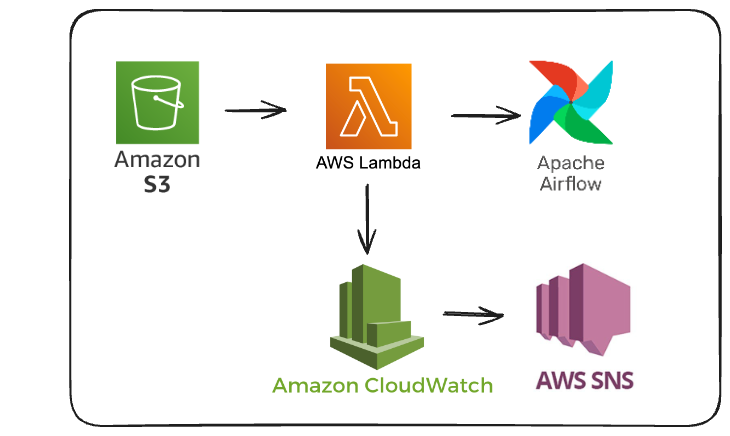

# S3-Triggered MWAA Pipeline via Lambda

## Overview

This repository contains infrastructure and code to implement an event-driven data pipeline using AWS services. A file landing in a specific S3 folder triggers a Lambda function, which in turn triggers an MWAA (Managed Workflows for Apache Airflow) DAG for processing. This design addresses the inefficiencies of a previously schedule-based ingestion system.

## Problem Context

The original ingestion process for partner data used a **single** workflow to **sequentially** check for and process files from multiple partners (e.g., LeafHome, RBA, Endurance) **by schedule**. This caused two major issues:

- **Processing Delays:** Files often waited up to two hours before being processed, even if they had already landed in S3.
- **Wasted Resources:** The ingestion DAG (`partners_caller`) ran 15–17 times daily because the DAG constantly checks if a file becomes avaialable for processing, despite partners uploading files at most once per day. 

These led to late reporting, manual triggers from the business, and inefficient compute usage.

## Proposed Solution

This new design implements an **event-driven approach** using the following AWS services:

- **S3 Event Notification:** Configured to detect file uploads matching a predefined pattern in a specific folder.
- **AWS Lambda:** Triggered by S3 event; invokes an MWAA DAG via the Airflow REST API.
- **Amazon MWAA:** Executes a DAG tailored to the partner's file ingestion.
- **Amazon CloudWatch + SNS:** Monitors the Lambda function and sends alerts on failure to the team email via SNS subscription.

## Benefits

- **Timely Ingestion:** DAG is triggered as soon as the relevant file arrives in S3.
- **Resource Efficiency:** Eliminates unnecessary daily executions of `partners_caller` DAG.
- **Improved Reliability:** Fewer manual interventions and reduced risk of ingestion lag.
- **Operational Alerting:** Failures are monitored and notified via email alerts.

## Architecture

## Setup Instructions

1. **Configure S3 Bucket Notification**
   - Enable event notifications for s3:ObjectCreated:* operations on the target folder.
   - Use a filter to match file naming patterns (e.g., `rba_matchback_*.csv`).
   - Set Lambda as the destination.

2. **Configure IAM Permissions**
   - Create an IAM role for the Lamdba function
   - Requires IAM permissions to invoke MWAA and access logs.
    
4. **Deploy Lambda Function**
   - Includes logic to call Airflow's REST API.
   - Environment variables for DAG name, MWAA API endpoint, and authentication.

5. **Configure CloudWatch Alarm & SNS**
   - Create alarms for Lambda failure metrics.
   - Subscribe team email to SNS topic for notifications.
